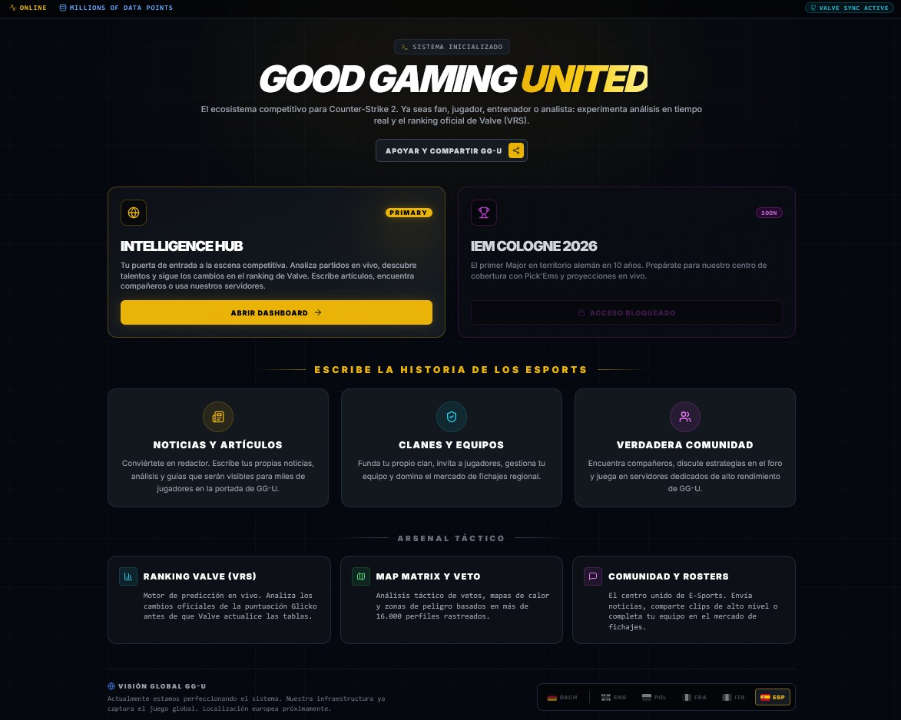
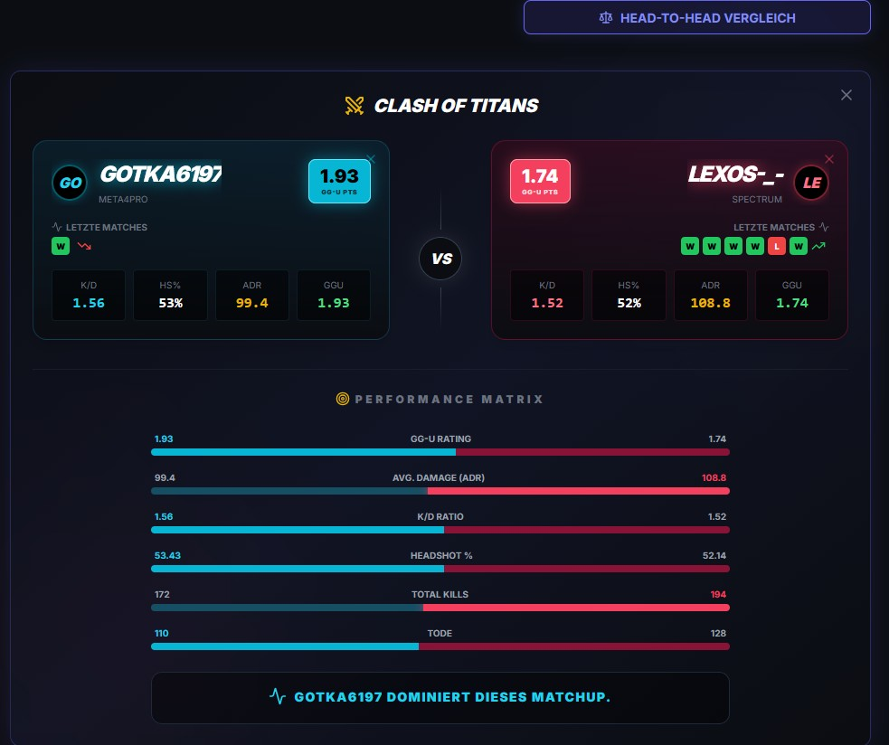
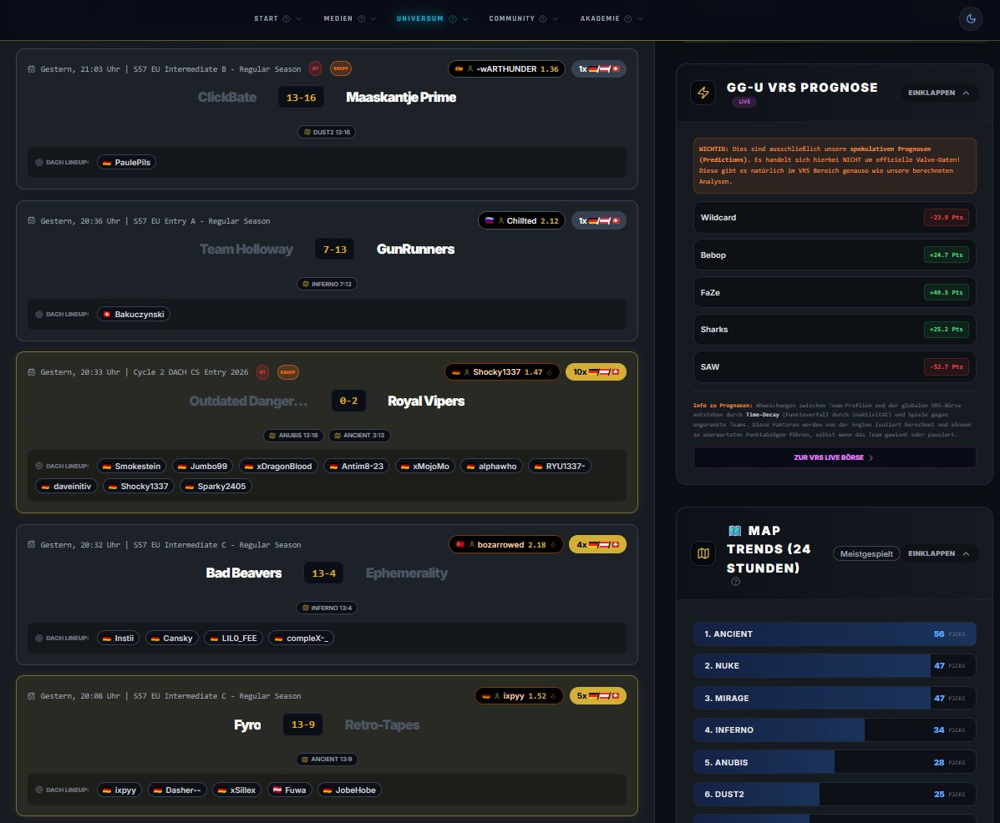
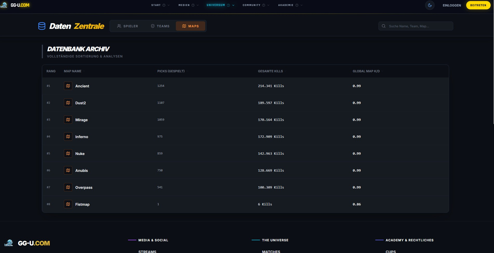
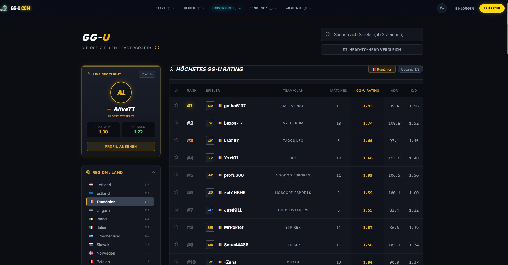
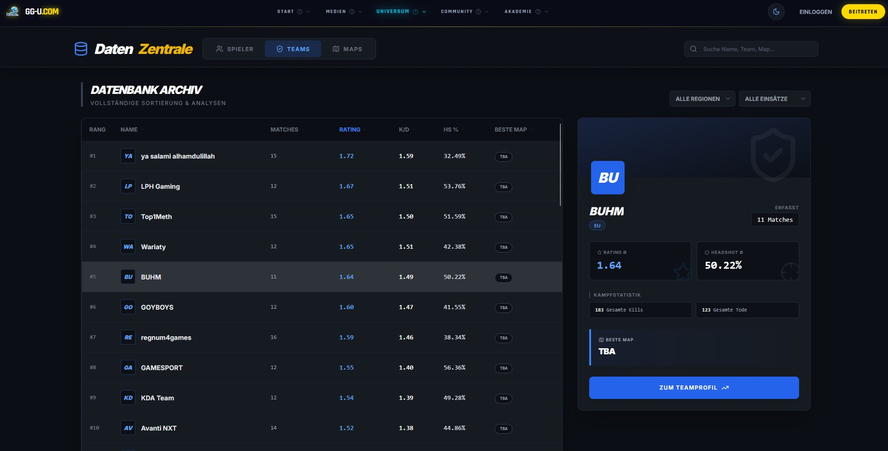
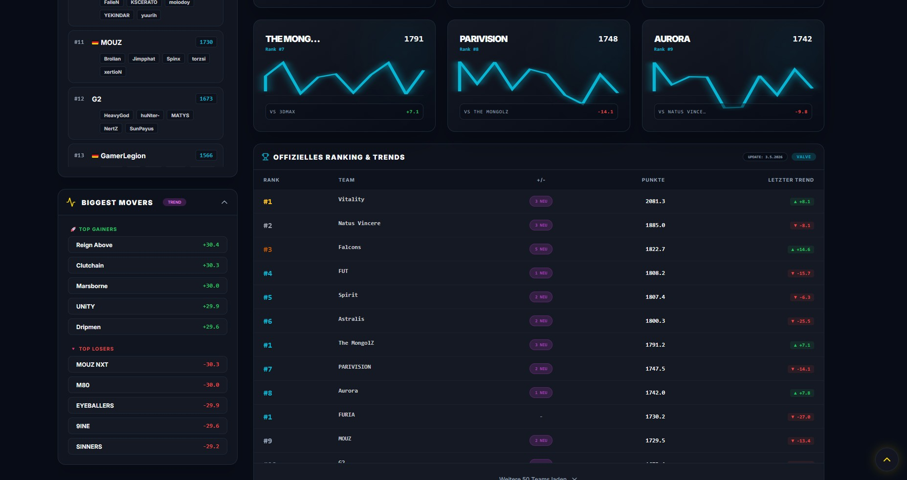
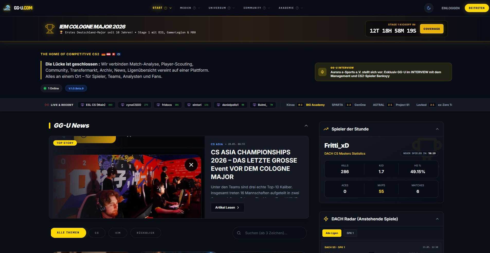
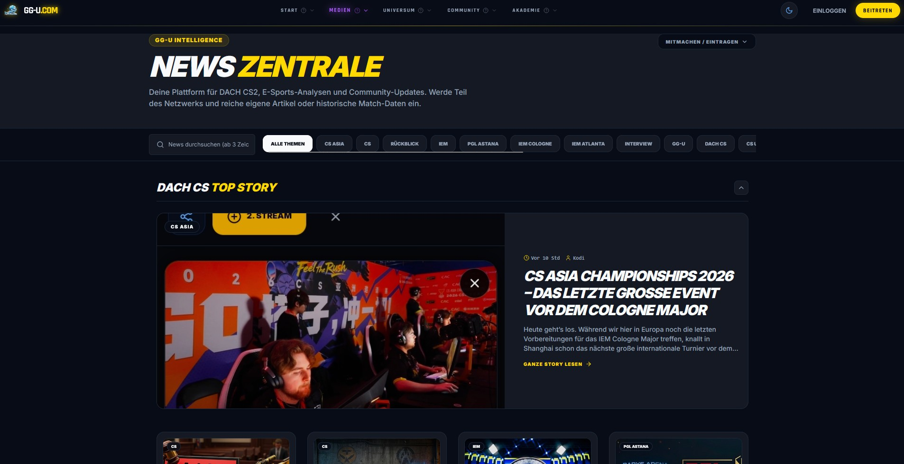
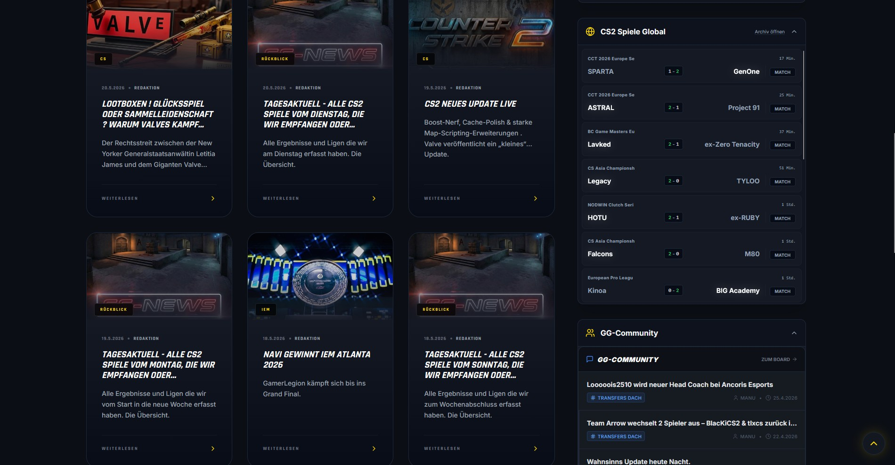

# Good Gaming United (GG-U)

**The Official CS2 Intelligence Platform**  
Real-time analytics • Valve VRS • Player & Team Stats • Predictions • Community

> The competitive ecosystem for **Counter-Strike 2**.  
> Whether you’re a fan, player, coach, or analyst — experience real-time analysis and the official Valve Ranking System (VRS).

---

## ✨ What is GG-U?

**GG-U** is the ultimate data-driven platform for the CS2 competitive scene. It combines:

- Official **Valve VRS** leaderboards & live predictions
- Deep-dive player & team statistics
- Advanced head-to-head comparisons
- Map performance analytics
- Real-time match coverage & news
- Tactical intelligence hub for the DACH region (and beyond)

Built for the entire CS2 ecosystem — from grassroots to Tier-1.

## 🚀 Key Features

### 📊 **Daten Zentrale (Data Central)**
- Player leaderboards (GG-U Rating, ADR, K/D, HS%)
- Team rankings & detailed statistics
- Comprehensive **map database** with pick rates, kills and global K/D

### ⚔️ **Head-to-Head Vergleich**
Direct player comparisons with visual performance matrix.

### 🔮 **GG-U VRS Prognose**
Live predictions and point trends based on Valve’s official ranking system.

### 🌐 **The Universe**
Live & recent matches, map trends, and the full competitive overview.

### 📰 **News Zentrale & Intelligence Hub**
Latest CS2 news, articles, and in-depth analysis — focused on DACH and international events (IEM Cologne, CS Asia, etc.).

### 👥 **Community & Rosters**
Transfer market, clan management, and true community features.

---

## 📸 Screenshots

### 1. Head-to-Head Player Comparison
  
*Detailed player comparison with GG-U Rating, ADR, K/D, HS% and performance matrix.*

### 2. The Universe – Live Matches & VRS Prognose
  
*Recent matches, GG-U VRS predictions, map pick trends and DACH league overview.*

### 3. Map Statistics (Datenbank Archiv)
  
*Full map database with picks, total kills and global K/D ratios.*

### 4. Player Leaderboards
  
*Top GG-U rated players in the DACH region (gotka6197 currently #1).*

### 5. Team Rankings
  
*Team leaderboard with detailed stats (BUHM highlighted).*

### 6. VRS Ranking & Trends
  
*Official VRS rankings, biggest movers and point trends.*

### 7. Homepage & News
  
  

---

## 🛠️ Tech & Status

- **Live & Synced** with Valve VRS
- Modern dark UI optimized for esports
- Multi-language support (German primary, English & Spanish and many more in progress )
- Currently in **active development / public beta**

---

## 📂 Project Structure (relevant for contributors)
public/
├── headtohead.jpg
├── universe.jpg
├── statsmaps.jpg
├── universeplayer.jpg
├── statsteam.jpg
├── vrspredictmitte.jpg
├── landing3.jpg
├── news1start.jpg
├── home1.jpg
├── home2.jpg
└── ...

---

**Ready to dominate the CS2 stats game?**  
⭐ Star the repo and join the movement!

*Made with passion for the CS2 scene by the GG-U.com Team.*

